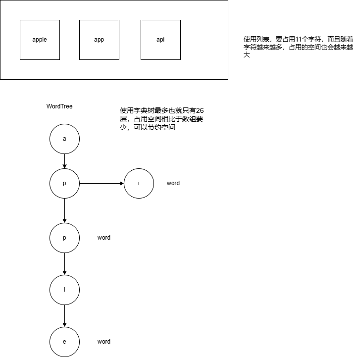

代码沙箱

## 判题机模块预开发

目的：跑通完整的业务流程


## 梳理判题模块和代码沙箱的关系

判题模块：调用代码沙箱，把代码和输入交给代码沙箱去执行

代码沙箱：只负责接受代码和输入，返回编译执行的结果，不负责判题（可以作为一个独立的项目 / 服务，提供给其他的需要执行代码的项目去使用）

这两个模块完全解耦


## 代码沙箱开发


1）定义代码沙箱的接口，提高通用性

之后我们的项目代码只调用接口，不调用具体的实现类，这样在你使用其他的代码沙箱实现类时，就不用去修改名称了，便于扩展


`代码沙箱的请求接口中，timeLimit 可加可不加，可自行扩展，即时中断程序`


扩展思路：增加一个查看代码沙箱状态的接口	


2）定义多种不同的代码沙箱实现

示例代码沙箱：仅为了跑通业务流程

远程代码沙箱：实际调用接口的沙箱

第三方代码沙箱：调用网上现成的代码沙箱，https://github.com/criyle/go-judge


3）编写单元测试，验证单个代码沙箱的执行

```java
@SpringBootTest
class CodeSandBoxTest {

    @Test
    void executeCode() {
        CodeSandBox codeSandBox = new ExampleCodesandbox();
        String code = "int main = { }";
        String language = QuestionSubmitLanguageEnum.JAVA.getValue();
        List<String> inputList = Arrays.asList("1 2", "3 4");
        ExecuteCodeRequest executeCodeRequest = ExecuteCodeRequest.builder()
                .code(code)
                .language(language)
                .inputList(inputList)
                .build();
        ExecuteCodeResponse executeCodeResponse = codeSandBox.executeCode(executeCodeRequest);
        Assertions.assertNotNull(executeCodeResponse);
    }
}
```


但是现在的问题是，我们把 new 某个沙箱的代码写死了，如果后面项目要引用其他沙箱，可能要该很多地方的代码。


4）使用工厂模式，根据用户传入的字符串参数（沙箱类别），来生成对应的代码沙箱实现类。

此处使用静态工厂模式，实现比较简单，符合我们的要求

```Java
/**
 * 代码沙箱工厂（根据字符串参数创建指定的代码沙箱实例）
 */
public class CodeSandboxFactory {

    /**
     * 创建代码沙箱示例
     * @param type
     * @return
     */
    public static CodeSandBox newInstance(String type){
        switch (type){
            case "example":
                return new ExampleCodesandbox();
            case "remote":
                return new RemoteCodesandbox();
            case "thirdParty":
                return new ThirdPartyCodesandbox();
            default:
                return new ExampleCodesandbox();
        }
    }

}
```

> 扩展思路：如果确定代码沙箱示例不会出现线程安全问题、可复用，那么可以使用


由此，我们可以根据字符串动态生成实例，提高了通用性：

```Java
public static void main(String[] args) {
    Scanner scanner = new Scanner(System.in);
    while (scanner.hasNext()){
        String type = scanner.next();
        CodeSandBox codeSandBox = CodeSandboxFactory.newInstance(type);
        String code = "int main = { }";
        String language = QuestionSubmitLanguageEnum.JAVA.getValue();
        List<String> inputList = Arrays.asList("1 2", "3 4");
        ExecuteCodeRequest executeCodeRequest = ExecuteCodeRequest.builder()
                .code(code)
                .language(language)
                .inputList(inputList)
                .build();
        ExecuteCodeResponse executeCodeResponse = codeSandBox.executeCode(executeCodeRequest);
    }
}
```

5）参数配置化，把项目中的一些可以交给用户去自定义的选项或字符串，写到配置文件中。这样开发者只需要改配置文件，而不需要去看你的项目代码，就能够自定义使用你项目的更多功能

application.yml 配置文件中指定变量：

```yml
# 代码沙箱配置
codesandbox:
  type:example
```

在 Spring 的 Bean 中通过 @Value 注解读取：

```java
@Value("${codesandbox.type:example}")
private String type;
```


6）代码沙箱能力增强

比如：我们需要在调用代码沙箱前，输出请求参数日志；在代码沙箱调用后，输出响应结果日志，便于管理员去分析。


Q：每个代码沙箱类都写一遍 log.info() ？难道每次调用代码沙箱前后都执行 log？

A：使用代理模式，提供一个 Proxy，来增强代码沙箱的能力（代理模式作用就是增强能力）。


使用方式：

```java
CodeSandBox codeSandBox = CodeSandboxFactory.newInstance(type);
// 修改的地方
codeSandBox = new CodeSandboxProxy(codeSandBox);
```

7）示例代码：

```java
/**
 * 示例代码沙箱（仅为了跑通业务流程）
 */
@Slf4j
public class ExampleCodesandbox implements CodeSandBox {
    @Override
    public ExecuteCodeResponse executeCode(ExecuteCodeRequest executeCodeRequest) {
        List<String> inputList = executeCodeRequest.getInputList();
        String code = executeCodeRequest.getCode();
        String language = executeCodeRequest.getLanguage();

        ExecuteCodeResponse executeCodeResponse = new ExecuteCodeResponse();
        executeCodeResponse.setOutputList(inputList);
        executeCodeResponse.setMessage("测试执行成功");
        executeCodeResponse.setStatus(QuestionSubmitStatusEnum.SUCCEED.getValue());
        JudgeInfo judgeInfo = new JudgeInfo();
        judgeInfo.setMessage(JudgeInfoMessageEnum.ACCEPTED.getText());
        judgeInfo.setTime(100L);
        judgeInfo.setMemory(100L);
        executeCodeResponse.setJudgeInfo(judgeInfo);
        return executeCodeResponse;
    }
}
```


### 小知识 - Lombok Builder 注解

实体类加上：

```java
@Data
@Builder
@NoArgsConstructor
@AllArgsConstructor
public class ExecuteCodeRequest {

    private List<String> inputList;

    private String code;

    private String language;
}
```

可以使用链式的方式更方便地给对象赋值：

```Java
ExecuteCodeRequest executeCodeRequest = ExecuteCodeRequest.builder()
        .code(code)
        .language(language)
        .inputList(inputList)
        .build();
```


## 判断服务完整业务流程开发


### 判题服务业务流程：

1）传入题目的提交 id，获取到对应的题目、提交题目（包含代码、编程语言等）

2）如果题目提交状态不为等待中，就不用重复执行了

3）更改判题（题目提交）的状态为 ”判题中“，也能让用户及时看到代码

4）调用沙箱，获取到执行结果

5）根据沙箱的执行结果，设置题目的判题状态和信息


### 判断逻辑：

1. 先判断沙箱执行的结果输出数量是否和预期输出数量相等
2. 依次判断每一项输出和预期输出是否相等
3. 判题题目的限制是否符合要求
4. 可能还有其他的异常情况


### 策略模式优化

我们的判题策略可能会有多种，比如：我们的代码沙箱本身执行程序需要消耗时间，这个时间可能不同的编程语言是不同的，比如沙箱执行 Java 要额外花 10s 的时间（只是举个例子）


我们可以采用策略模式，针对不同的情况，定义独立的策略，而不是把所有的判题逻辑、if…else 代码全部混在一起写。


首先编写默认判题模块


如果选择某种判题策略的过程比较复杂，都写在调用判题服务的代码中，代码会越来越复杂，会有很多 if..else，所以，建议单独编写一个判断策略的类

```java
JudgeStrategy judgeStrategy = new DefaultJudgeStrategy();
if (language.equals("Java")){
    judgeStrategy = new JavaLanguagetJudgeStrategy();
}
JudgeInfo judgeInfo = judgeStrategy.doJudge(judgeContext);
```


定义 JudgeManager，目的是尽量简化对判题功能的使用，让调用最简单

```java
/**
 * 判题管理（简化调用）
 */
@Service
public class JudgeManager {
    /**
     * 判题
     * @param judgeContext
     * @return
     */
    JudgeInfo doJudge(JudgeContext judgeContext){
        QuestionSubmit questionSubmit = judgeContext.getQuestionSubmit();
        String language = questionSubmit.getLanguage();
        JudgeStrategy judgeStrategy = new DefaultJudgeStrategy();
        if ("Java".equals(language)){
            judgeStrategy = new JavaLanguagetJudgeStrategy();
        }
        return judgeStrategy.doJudge(judgeContext);
    }
}
```


## 历史问题修复

代码编辑器切换语言失败问题

解决：监听 language 属性，动态更改编辑器的语言

```vue
// 动态更改编辑器的语言
watch(
  () => props.language,
  () => {
    if (codeEditor.value) {
      monaco.editor.setModelLanguage(
        toRaw(codeEditor.value).getModel(),
        props.language
      );
    }
  }
);
```


## 代码沙箱实现

代码沙箱：只负责接受代码和输入，返回编译执行的结果，不负责判题（可以作为一个独立的项目 / 服务，提供给其他的需要执行代码的项目去使用）

以 Java 编程语言为主，带大家实现代码沙箱，重要的是学习思想、学关键流程

`扩展：可以自行实现 C++ 语言的代码沙箱`


新建一个 Spring Boot Web 项目，最终这个项目要提供一个能够执行代码、操作代码沙箱的接口。

选择 Java 8、Spring Boot 2.7 版本！

编辑启动配置：

```yml
server:
  port: 8090
```

编写测试接口，通过 endpoint 验证能否访问：

```java
@RestController("/")
public class MainController {

    @GetMapping("/health")
    public String healthCheck(){
        return "ok";
    }
}
```


## C++语言实现

代码沙箱需要：接受代码 — 编译代码( g++ ) — 执行代码

### 思考：为什么代码沙箱要接受和输出一组运行用例

前提：我们的每道题目有多组测试用例

如果是每个用例单独调用一次代码沙箱，会调用多次接口、需要多次网络传输、程序要多次编译、记录程序的执行状态（重复的代码不重复编译）


这是一种很常见的性能优化方法！（批处理）


Cpp 镜像安装参考：https://blog.csdn.net/m0_63086198/article/details/143077220?ops_request_misc=%257B%2522request%255Fid%2522%253A%25226237eb4a2545579e2bbe25716349131c%2522%252C%2522scm%2522%253A%252220140713.130102334.pc%255Fall.%2522%257D&request_id=6237eb4a2545579e2bbe25716349131c&biz_id=0&utm_medium=distribute.pc_search_result.none-task-blog-2~all~first_rank_ecpm_v1~rank_v31_ecpm-1-143077220-null-null.142

### 编译命令

```bash
g++ -std=c++17 Main.cpp -o Main
```

出现中文乱码的解决方案：

```shell
g++  -fexec-charset=gbk Main.cpp -o Main.exe
```


### 执行代码

Linux或者macOS

```shell
./Main
```

Windows

```shell
.\Main.exe
.\Main
```


如果遇到message=null，如图

解决方案：

```java
 /**
     * 3. 执行文件，得到输出列表结果
     *
     * @param userCodeFile
     * @param inputList
     * @return
     */
public List<ExecuteMessage> runFile(File userCodeFile, List<String> inputList) {

        List<ExecuteMessage> executeMessageList = new ArrayList<>();
        // .\Main.exe
        // 1. 获取可执行文件路径
        File parentDir = userCodeFile.getParentFile();
        File exeFile = new File(parentDir, "Main.exe");
        if (!exeFile.exists()) {
            throw new RuntimeException("可执行文件未生成");
        }

        // 2. 构造运行命令（处理参数和空格）
//        String inputArgs = String.join(" ", inputList);
        for (String inputArgs : inputList) {
            String runCmd = parentDir + File.separator + "Main.exe";
            try {
                Process runProcess = Runtime.getRuntime().exec(runCmd);

                // 关键修改：向进程写入输入数据，解决 message=null 的问题
                try (BufferedWriter writer = new BufferedWriter(
                        new OutputStreamWriter(runProcess.getOutputStream()))) {
                    // 将输入参数格式化为程序所需格式（如换行分隔）
                    String formattedInput = inputArgs.replace(" ", "\n") + "\n";
                    writer.write(formattedInput);
                    writer.flush(); // 必须刷新缓冲区
                }

                // 超时控制
                new Thread(() -> {
                    try {
                        Thread.sleep(TIME_OUT);
                        runProcess.destroy();
                        System.out.println("超时中断");
                    } catch (InterruptedException e) {
                        Thread.currentThread().interrupt();
                    }
                }).start();

                // 读取输出
                ExecuteMessage executeMessage = ProcessUtils.runProcessAndGetMessage(runProcess, "运行");
                System.out.println(executeMessage);
                executeMessageList.add(executeMessage);
            } catch (IOException e) {
                throw new RuntimeException("执行异常", e);
            }
        }

        return executeMessageList;
    }
```


## docker 镜像

```bash
docker pull echocen/gcc:v1
docker pull echocen/openjdk:v1
docker pull echocen/python:v1
```


### docker 操作不用 sudo

操作步骤:
1.创建docker组：

```bash
sudo groupadd docker
```

2.将当前用户加入docker组：

```bash
sudo gpasswd -a ${USER} docker
```

3.重启服务：

```bash
sudo service docker restart
```

1
4.刷新Docker成员：

```bash
newgrp - docker
```


## Java 原生实现代码沙箱

原生：尽可能不借助第三方库和依赖，用最干净、最原始的方式实现代码沙箱

代码沙箱需要：接受代码 => 编译代码（javac） => 执行代码（java）


编写示例代码，注意要去掉包名，放到 resource 目录下：

```java
public class SimpleCompute {
    public static void main(String[] args) {
        int a = Integer.parseInt(args[0]);
        int b = Integer.parseInt(args[1]);
        System.out.println("结果：" + (a + b));
    }
}
```


编译和执行代码：

```java
javac .\SimpleCompute.java
java -cp . SimpleCompute 
```


为什么编译后的程序中文乱码呢？

命令行终端的编码是 GBK，和 java 代码文件本身的编码 UTF-8不一致，导致乱码


通过 chcp 命令查看编码，GBK 是 936， UTF-8 时 65001

`chcp 936`

但是不建议通过改变终端编码来解决编译乱码的情况，因为别人用你的代码编译时也要在终端修改环境，兼容性很差

正确做法：

```java
javac -encoding utf-8 .\ SimpleCompute.java
```


实际 OJ 系统中，对用户输入的代码会有一定的要求，便于系统统一处理。所以此处，我们把用户输入代码的类名限制为 Main（参考 Poj），可以减少类名不一致的风险，而且不用从用户代码中提取类名，更方便。

示例代码：

```Java
public class Main {
    public static void main(String[] args) {
        int a = Integer.parseInt(args[0]);
        int b = Integer.parseInt(args[1]);
        System.out.println("结果：" + (a + b));
    }
}
```

实际执行：

```typescript
javac -encoding utf-8 .\Main.java
java -cp . Main 1 2 
```

### Linux Ubuntu 编译运行 Java


## 核心流程实现

核心实现思路：用程序代替人工，用程序来操作命令行，去编译执行代码

Java 进程执行管理类：Process


1. 把用户的代码保存为文件
2. 编译代码，得到 class 文件
3. 执行代码，得到输出结果
4. 收集整理输出结果
5. 文件清理
6. 错误处理，提升程序健壮性


### 1、把用户的代码保存为文件

引入 Hutool 工具类

```xml
<!-- https://hutool.cn/docs/index.html#/-->
<dependency>
    <groupId>cn.hutool</groupId>
    <artifactId>hutool-all</artifactId>
    <version>5.8.8</version>
</dependency>
```


新建目录，每个用户的代码都存放在独立目录下，便于维护;

```java
String userDir = System.getProperty("user.dir");
String globalCodePathName = userDir + File.separator + GLOBAL_CODE_DIR_NAME;
// 判断全局代码目录是否存在，没有则新建
if (!FileUtil.exist(globalCodePathName)) {
    FileUtil.mkdir(globalCodePathName);
}

// 把用户的代码隔离存放
String userCodeParentPath = globalCodePathName + File.separator + UUID.randomUUID();
// 实际的路径
String userCodePath = userCodeParentPath + File.separator + GLOBAL_JAVA_CLASS_NAME;
File userCodeFile = FileUtil.writeString(code, userCodePath, StandardCharsets.UTF_8);
```


### 2、编译代码，得到 class 文件

Java 执行程序：

```java
String compileCmd = String.format("javac -encoding utf-8 %s", userCodeFile.getAbsolutePath());
Process compileProcess = Runtime.getRuntime().exec(compileCmd);
```

Java 获取控制台的输出，通过 exitValue 判断程序是否正常返回，从 inputStream 和 errorStream 获取控制台输出：

```java
// 等待程序执行，获取错误码
int exitValue = compileProcess.waitFor();
// 正常退出
if (exitValue == 0) {
    System.out.println("编译成功");
    // 分批获取进程的正常输出
    BufferedReader bufferedReader = new BufferedReader(
            new InputStreamReader(compileProcess.getInputStream()));
    StringBuilder compileOutputStringBuilder = new StringBuilder();
    // 逐行读取
    String compileOutputLine;
    while ((compileOutputLine = bufferedReader.readLine()) != null){
        compileOutputStringBuilder.append(compileOutputLine);
    }
    System.out.println(compileOutputStringBuilder);
} else {
    // 异常退出
    // 分批获取进程的正常输出
    BufferedReader bufferedReader = new BufferedReader(
            new InputStreamReader(compileProcess.getInputStream()));
    StringBuilder compileOutputStringBuilder = new StringBuilder();
    // 逐行读取
    String compileOutputLine;
    while ((compileOutputLine = bufferedReader.readLine()) != null){
        compileOutputStringBuilder.append(compileOutputLine);
    }
    // 分批获取进程的错误输出
    BufferedReader errorBufferedReader = new BufferedReader(
            new InputStreamReader(compileProcess.getErrorStream()));
    StringBuilder errorCompileOutputStringBuilder = new StringBuilder();
    // 逐行读取
    String errorCompileOutputLine;
    while ((errorCompileOutputLine = errorBufferedReader.readLine()) != null){
        errorCompileOutputStringBuilder.append(errorCompileOutputLine);
    }
    System.out.println(compileOutputStringBuilder);
}
```

编写一个工具类，执行进程，并且获取输出：

```java
/**
 * 进程工具类
 */
public class ProcessUtils {

    /**
     * 执行进程获取信息
     * @param runProcess
     * @param opName
     * @return
     */
    public static ExecuteMessage runProcessAndGetMessage(Process runProcess, String opName){
        ExecuteMessage executeMessage = new ExecuteMessage();
        
        try {
            // 等待程序执行，获取错误码
            int exitValue = runProcess.waitFor();
            executeMessage.setExitValue(exitValue);
            // 正常退出
            if (exitValue == 0) {
                System.out.println(opName + "成功");
                // 分批获取进程的正常输出
                BufferedReader bufferedReader = new BufferedReader(
                        new InputStreamReader(runProcess.getInputStream()));
                StringBuilder compileOutputStringBuilder = new StringBuilder();
                // 逐行读取
                String compileOutputLine;
                while ((compileOutputLine = bufferedReader.readLine()) != null){
                    compileOutputStringBuilder.append(compileOutputLine);
                }
                executeMessage.setMessage(compileOutputStringBuilder.toString());
            } else {
                // 异常退出
                System.out.println(opName + "失败, 错误码: " + exitValue);
                // 分批获取进程的正常输出
                BufferedReader bufferedReader = new BufferedReader(
                        new InputStreamReader(runProcess.getInputStream()));
                StringBuilder compileOutputStringBuilder = new StringBuilder();
                // 逐行读取
                String compileOutputLine;
                while ((compileOutputLine = bufferedReader.readLine()) != null){
                    compileOutputStringBuilder.append(compileOutputLine);
                }
                // 分批获取进程的错误输出
                BufferedReader errorBufferedReader = new BufferedReader(
                        new InputStreamReader(runProcess.getErrorStream()));
                StringBuilder errorCompileOutputStringBuilder = new StringBuilder();
                // 逐行读取
                String errorCompileOutputLine;
                while ((errorCompileOutputLine = errorBufferedReader.readLine()) != null){
                    errorCompileOutputStringBuilder.append(errorCompileOutputLine);
                }
                executeMessage.setErrorMessage(errorCompileOutputStringBuilder.toString());
            }
        } catch (Exception e) {
            e.printStackTrace();
        }
        return executeMessage;
    }

}

```


### 3、执行代码，得到输出结果

同样是使用 process 运行，命令中记得增加 `-Dfile.encoding=UTF-8` 参数，解决中文乱码：

```java
String runCmd = String.format("java -Dfile.encoding=UTF-8 -cp %s Main %s", userCodeParentPath, inputArgs);
```


很多 OJ 都是 ACM 模式，需要和用户交互的方式，让用户不断输入内容并且获取输出，比如

```java
import java.io.*;
import java.util.*;

public class Main {
    public static void main(String args[]) throws Exception {
        Scanner cin=new Scanner(System.in);
        int a = cin.nextInt();
        int b = cin.nextInt();
        System.out.println(a + b);
    }
}
```

对于此类程序，我们需要是使用 OutputStream 向程序终端发送参数，并及时获取结果，注意最后要关闭流释放资源。

示例代码如下：

```java
/**
 * 执行交互式进程获取信息
 *
 * @param runProcess
 * @param args
 * @return
 */
public static ExecuteMessage runInteractProcessAndGetMessage(Process runProcess, String args) {

    ExecuteMessage executeMessage = new ExecuteMessage();
    try {

        // 向控制台入程序
        OutputStream outputStream = runProcess.getOutputStream();
        OutputStreamWriter outputStreamWriter = new OutputStreamWriter(outputStream);
        String[] s = args.split(" ");
        String join = StrUtil.join("\n", s) + "\n";
        outputStreamWriter.write(join);
        // 相当于按了回车，执行输入的发送
        outputStreamWriter.flush();

        // 分批获取进程的正常输出
        InputStream inputStream = runProcess.getInputStream();
        BufferedReader bufferedReader = new BufferedReader(new InputStreamReader(inputStream));
        StringBuilder compileOutputStringBuilder = new StringBuilder();
        // 逐行读取
        String compileOutputLine;
        while ((compileOutputLine = bufferedReader.readLine()) != null) {
            compileOutputStringBuilder.append(compileOutputLine);
        }
        executeMessage.setMessage(compileOutputStringBuilder.toString());

        // 记得资源的释放，否则会卡死
        outputStream.close();
        outputStreamWriter.close();
        inputStream.close();
        runProcess.destroy();
    } catch (Exception e) {
        e.printStackTrace();
    }
    return executeMessage;
}
```


### 4、收集整理输出结果

获取程序执行时间，使用 spring 的 StopWatch 获取一段程序的执行时间

```java
StopWatch stopWatch = new StopWatch();
stopWatch.start();
stopWatch.stop();
executeMessage.setTime(stopWatch.getLastTaskTimeMillis());
```


`扩展：可以每个测试用例都有一个独立的内存、时间占有统计`

此处我们使用最大值来统计时间，便于后续判题服务计算程序是否超时：

```java
// 取用时最大值，便于判断是否超时
long maxTime = 0;
for (ExecuteMessage executeMessage : executeMessageList) {
    String errorMessage = executeMessage.getErrorMessage();
    if (StrUtil.isNotBlank(errorMessage)) {
        executeCodeResponse.setMessage(errorMessage);
        // 执行中存在错误
        executeCodeResponse.setStatus(3);
        break;
    }
    outputList.add(executeMessage.getMessage());
    Long time = executeMessage.getTime();
    if (time != null) {
        maxTime = Math.max(maxTime, time);
    }
}	
executeCodeResponse.setOutputList(outputList);
// 正常运行完成
if (outputList.size() == executeMessageList.size()) {
    executeCodeResponse.setStatus(1);
}
JudgeInfo judgeInfo = new JudgeInfo();
judgeInfo.setTime(maxTime);
```


### 5、文件清理

防止内存空间不足

```java
// 5. 文件清理
if (userCodeFile.getParentFile() != null){
    boolean del = FileUtil.del(userCodeParentPath);
    System.out.println("删除" + (del ? "成功" : "失败"));
}
```


### 6、错误处理

封装一个错误处理方法，当程序抛出异常时，直接返回错误即可：

```java
/**
 * 获取错误响应
 * @param e
 * @return
 */
private ExecuteCodeResponse getErrorResponse(Throwable e) {
    ExecuteCodeResponse executeCodeResponse = new ExecuteCodeResponse();
    executeCodeResponse.setOutputList(new ArrayList<>());
    executeCodeResponse.setMessage(e.getMessage());
    // 表示代码沙箱错误
    executeCodeResponse.setStatus(2);
    executeCodeResponse.setJudgeInfo(new JudgeInfo());
    return executeCodeResponse;
}
```


## 异常情况演示

到目前为止，核心流程已经实现，但是想要上线的话，怎么办？

用户提交恶意代码，怎么办？


### 1）执行阻塞，占用资源不释放

```java
/**
 * 无限睡眠（阻塞程序执行）
 */
public class Main {

    public static void main(String[] args) throws InterruptedException {
        long ONE_HOUR = 60 * 60 * 1000L;
        Thread.sleep(ONE_HOUR);
        System.out.println("睡完了");
    }
}
```


要把写好的代码复制到 resources 中，并且一定要把类名改为  Main ! 并且要把包名去掉！


### 2）占用内存，不释放

```java
import java.util.ArrayList;
import java.util.List;

/**
 * 无限占用空间（浪费内存）
 */
public class Main {
    public static void main(String[] args) {
        List<byte[]> bytes = new ArrayList<>();
        while (true) {
            bytes.add(new byte[10000]);
        }
    }
}
```

实际运行中，我们会发现，内存占用到达一定空间后，程序就自动报错：`java.lang.OutOfMemoryError: Java heap space`

这是 JVM 的一个保护机制。

JVisualVM 或 JConsole（在 jdk bin目录下） 工具，可以连接到 JVM 虚拟机上可视化来查看运行状态


### 3）读文件，文件信息泄露

直接通过相对路径获取文件：

```java
import java.io.File;
import java.io.IOException;
import java.nio.file.Files;
import java.nio.file.Paths;
import java.util.List;

/**
 * <p>Project: yuoj-code-sandbox
 * <p>Powered by Lantz On 2025/2/17
 *
 * @author Lantz
 * @version 1.0
 * @Description ReadFileError
 * @since 1.8
 */

/**
 * 读取服务器文件（文件信息泄露）
 */
public class Main {

    public static void main(String[] args) throws IOException {
        String userDir = System.getProperty("user.dir");
        String filePath = userDir + File.separator + "src/main/resources/application.yml";
        List<String> allLines = Files.readAllLines(Paths.get(filePath));
        System.out.println(String.join("\n", allLines));
    }
}
```


### 4）写文件，越权植入木马程序

假如有一个木马命令：java -version 2>&1

```java
import java.io.File;
import java.io.IOException;
import java.nio.file.Files;
import java.nio.file.Paths;
import java.util.Arrays;
import java.util.List;

/**
 * <p>Project: yuoj-code-sandbox
 * <p>Powered by Lantz On 2025/2/17
 *
 * @author Lantz
 * @version 1.0
 * @Description ReadFileError
 * @since 1.8
 */

/**
 * 向服务器写文件（植入危险程序）
 */
public class Main {

    public static void main(String[] args) throws IOException {
        String userDir = System.getProperty("user.dir");
        String filePath = userDir + File.separator + "src/main/resources/木马程序.bat";
        String errorProgram = "java -version 2>&1";
        Files.write(Paths.get(filePath), Arrays.asList(errorProgram));
        System.out.println("写木马成功，腻歪了");
    }
}
```


### 5）运行其他程序

直接通过 Process 执行危险程序，或者电脑上的其他程序：

```java
import java.io.*;
import java.nio.file.Files;
import java.nio.file.Paths;
import java.util.Arrays;

/**
 * <p>Project: yuoj-code-sandbox
 * <p>Powered by Lantz On 2025/2/17
 *
 * @author Lantz
 * @version 1.0
 * @Description ReadFileError
 * @since 1.8
 */

/**
 * 运行其他程序（比如危险木马）
 */
public class Main {

    public static void main(String[] args) throws IOException, InterruptedException {
        String userDir = System.getProperty("user.dir");
        String filePath = userDir + File.separator + "src/main/resources/木马程序.bat";
        Process process = Runtime.getRuntime().exec(filePath);
        process.waitFor();
        // 分批获取进程的正常输出
        BufferedReader bufferedReader = new BufferedReader(new InputStreamReader(process.getInputStream()));
        // 逐行读取
        String compileOutputLine;
        while ((compileOutputLine = bufferedReader.readLine()) != null) {
            System.out.println(compileOutputLine);
        }
        System.out.println("执行异常程序成功");

```


### 6）执行高危命令

甚至都不用写木马文件，直接执行系统自带的危险命令。

比如删除服务器的所有文件

比如执行 dir（windows），ls （Linux）获取系统上的全部文件


### 怎么解决？

1）超时控制

2）限制给用户分配的资源

3）限制代码 - 黑白名单

4）限制用户的操作权限（文件、网络、执行）

5）运行环境隔离


#### 1）超时控制

通过创建一个守护线程，超时后自动中断 process 实现：

```java
// 超市控制
new Thread(() -> {
    try {
        Thread.sleep(TIME_OUT);
        System.out.println("超时了，中断");
        runProcess.destroy();
    } catch (InterruptedException e) {
        throw new RuntimeException(e);
    }
}).start();
```


#### 2）限制给用户分配的资源

我们不能让每个 java 进程的执行占用的 JVM 最大堆内存空间都和系统的一致，实际上应该小一点，比如说 256MB

在启动 Java 时，可以指定 JVM 的参数：-Xms256m（最大堆空间的大小） -Xms（初始堆的空间大小）

```java
java -Xmx256m 
```


注意！-Xmx 参数、JVM 的堆内存限制，不等同于系统实际占用的最大资源，可能会超出


如果需要更严格的内存限制，要在系统层面去限制，而不是  JVM 层面的限制。

如果是 Linux 系统，可以使用 cgroup 来实现对某个进程的 CPU、内存等资源的分配


#### 3）限制代码 - 黑白名单

先顶一个黑白名单，比如哪些操作是禁止的，可以是一个列表

```java
private static final List<String> blackList = Arrays.asList("Files", "exec");
```


HuTool 字典树工具类：WordTree，可以用更少的空间存储更多的敏感词汇，实现更高效的敏感词汇查找：



`可以写在简历上`

示例代码：

1）先初始化：

```java
private static final WordTree WORD_TREE;

static {
    // 初始化字典树
    WORD_TREE = new WordTree();
    WORD_TREE.addWords(blackList);
}
```

2）校验：

```java
// 校验代码中是否包含黑名单中的命令
FoundWord foundWord = WORD_TREE.matchWord(code);
if (foundWord != null){
    System.out.println("包含禁止词: " + foundWord.getFoundWord());
    return null;
}
```


缺点：

1）你无法遍历所有的黑名单

2）不同的编程语言，你对应的领域、关键词都不一样，限制人工成本很大


#### 4）限制用户的操作权限（文件、网络、执行）

限制用户对文件、内存、CPU、网络等资源的操作和访问。

Java 安全管理器（Security Manager）是 Java 提供的保护 JVM、Java 安全的机制，可以实现更严格的资源和操作限制。


编写安全管理器，只需要继承 Security Manager。

所有权限放开：

`// super.checkPermission(perm);`   这一行要注释掉，不然会禁用所有权限

```java
import java.security.Permission;

/**
 * 默认安全管理器
 */
public class DefaultSecurityManager extends SecurityManager{

    // 检查所有权限
    @Override
    public void checkPermission(Permission perm) {
        System.out.println("默认不做任何限制");
        System.out.println(perm);
        // super.checkPermission(perm);
    }
}
```


所有权限拒绝：

```java
import java.security.Permission;

/**
 * 禁用所有安全管理器
 */
public class DenySecurityManager extends SecurityManager{

    // 检查所有权限
    @Override
    public void checkPermission(Permission perm) {
        throw new SecurityException("权限异常：" + perm.toString());
    }
}
```


限制读权限：

```java
@Override
public void checkRead(String file) {
    System.out.println(file);
    if (file.contains("hutool")) {
        return;
    }
    throw new SecurityException("checkRead 权限异常：" + file);
}
```


实际情况下，我们只需要限制子程序的权限即可，没必要限制开发者自己写的程序

具体操作如下：

1）根据需要开发自定义的安全管理器（比如 MySecurityManager）

2）复制 MySecurityManager 类到 resource/security 目录下，编译安全管理器，去掉包名

3）手动输入命令编译 MySecurityManager 类，得到 class 文件

4）在运行 java 程序时，指定安全管理器 class 文件的路径、安全管理器的名称。

`注意：Windows 下要用逗号分隔`

命令如下：

```java
java -Xmx256m -Dfile.encoding=UTF-8 -cp %s;%s -Djava.security.manager=MySecurityManager Main %s
```

##### 优点

权限控制很灵活，实现简单


##### 缺点

1. 如果要做比较严格的权限限制，需要自己去判断哪些文件、包名需要允许读写，粒度太细了，难以精细控制
2. 安全管理器本身也是 Java 代码，也有可能存在漏洞（还是程序上的控制，没到系统的层面）


#### 5）运行环境隔离

系统层面上，把用户程序封装在沙箱里，和宿主机（我们的电脑 / 服务器）隔离开 Docker 容器技术能够实现（底层是用 cgroup、namespace 等方式实现的）


## Docker 安装

### 远程开发


### 纯远程开发

运行相同项目对比：


### Docker 安装镜像报错：

```bash
docker: Error response from daemon: Get "https://registry-1.docker.io/v2/": context deadline exceeded (Client.Timeout exceeded while awaiting headers). See 'docker run --help'
```

解决方案：

```bash
sudo mkdir -p /etc/docker
sudo tee /etc/docker/daemon.json <<-'EOF'
 {
 "registry-mirrors": [
"https://docker.nju.edu.cn", 
"https://hub.littlediary.cn",
"https://hub.xdark.top",
"https://dockerpull.org",
"https://hub.crdz.gq",
"https://docker.1panel.live",
"https://docker.unsee.tech"
]
}
EOF
sudo systemctl daemon-reload
sudo systemctl restart docker
```

远程开发成功运行但没有显示调试窗口：

```xml
<configuration>
  <mainClass>com.yuoj.test2.Test2Application</mainClass>
    <skip>false</skip>
</configuration>
```


### 安装SSH

```bash
sudo apt-get install openssh-server
ps -ef | grep ssh
```

### 安装 docker 以及部署远程开发教程：

https://www.bilibili.com/video/BV1h94y1k7Jf/?spm_id_from=333.1007.top_right_bar_window_history.content.click


### 调试

```bash
java -agentlib:jdwp=transport=dt_socket,server=y,suspend=n,address=5005 -jar /home/lantz03/code/target/TestOj-0.0.1-SNAPSHOT.jar --spring.profiles.active=prod
```


```java
-Djdk.lang.Process.launchMechanism=vfork
```


## 代码沙箱 Docker 技术实现

### Docker 容器技术

为什么要用 Docker 容器技术？

为了提升系统的安全性，把不同的程序和宿主机进行隔离，使得某个程序（应用）的执行不会影响到系统本身。

Docker 技术可以程序和宿主机的隔离。


### 什么是容器？

理解为对一系列的应用程序、服务和环境的封装，从而把程序运行在一个隔离的、密闭的、隐私的空间内，对外整体提供服务

可以把一个容器理解为一个新的电脑（定制化操作系统）


### Docker 基本概念

镜像：用来创建容器的安装包，可以理解为给电脑安装操作系统的系统镜像。

容器：通过镜像来创建的一套运行环境，一个容器里可以运行多个程序，可以理解为一个电脑实例。

Dockerfile：制作镜像的文件，可以理解为制作镜像的一个清单


镜像仓库：存放镜像的仓库，用户可以从仓库下载现成的镜像，也可以把做好的镜像放到仓库里

推荐使用 docker 官方的镜像仓库：https://hub.docker.com/


### Docker 实现原理

> 对应题目：Docker 能实现哪些资源的隔离？

看图理解：

1. Docker 运行在 Linux 内核上
2. CGroups：实现了容器的资源隔离，底层是 Linux Cgroup 命令，能够控制进程使用的资源
3. Network 网络：实现容器的网络隔离，docker 容器内部的网络互不影响
4. Namespaces 命名空暗金：可以把进程隔离在不同的命名空间下，每个容器它都可以有自己的命名空间，不同的命名空间下的进程互不影响
5. Storage 存储空间：容器内的文件是相互隔离的，也可以去使用宿主机的文件


### Docker 常用操作 - 命令行

1）查看命令用法

```shell
docker COMMAND --help
```

查看具体子命令的用法

```shell
docker run --help
```


2）从远程仓库拉取现成的镜像

用法:

```shell
docker pull [options] name[:tag|@digest]

```

示例

```shell
docker run hello-world
```


3）根据镜像创建容器

```shell
docker create [OPTIONS] IMAGE [COMMAND] [ARG...]	
```


启动实例，得到容器实例 containerId：

```shell
sudo docker create hello-world
```


4）查看容器状态

```shell
sudo docker ps -a
```


5）启动容器

```shell
docker start [OPTIONS] CONTAINER [CONTAINER...]
```

示例：

```shell
sudo docker start practical_heyrovsky
```

6）查看日志

```shell
docker logs [OPTIONS] CONTAINER
```

示例：

```shell
sudo docker logs practical_heyrovsky
```

7）删除容器

格式用法：

```shell
docker rm [OPTIONS] CONTAINER [CONTAINER...]
```

一键全部删除

```shell
docker rm -f $(docker ps -aq)	
```

单个删除

```shell
docker rm recursing_poitras
```


8）删除镜像

用法：

```shell
docker images [OPTIONS] [REPOSITORY[:TAG]]
```

示例：

```shell
docker rmi openjdk:8u92-alpine -f
```


### Java Docker容器

官方入口：https://github.com/docker-java/docker-java

导入依赖：

```xml
<dependency>
    <groupId>com.github.docker-java</groupId>
    <artifactId>docker-java</artifactId>
    <version>3.3.0</version>
</dependency>
<!-- https://mvnrepository.com/artifact/com.github.docker-java/docker-java-transport-httpclient5 -->
<dependency>
    <groupId>com.github.docker-java</groupId>
    <artifactId>docker-java-transport-httpclient5</artifactId>
    <version>3.3.0</version>
</dependency>
```

DockerClientConfig：用于定义初始化DockerClient的配置（类比MySQL的连接、线程数配置）
DockerHttpClient：用于向Docker守护进程（操作Docker的接口）发送请求的客户端，低层封装（不推荐使用），你要自己构建请求参数（简单地理解成JDBC）
DockerClient（推荐）：才是真正和Docker守护进程交互的、最方便的SDK，高层封装，对DockerHttpClient再进行了一层封装（理解成MyBatis），提供了现成的增删 


### Linux Docker 远程开发

使用 IDEA Development 先上传代码到 Linux，然后使用 JetBrains 远程开发完全连接 Linux 实时开发。

如果无法启动程序，修改 settings 的 compiler配置：

```shell
-Djdk.lang.Process.launchMechanism=vfork
```


拉取镜像：

```java
// 获取默认的 Docker Client
DockerClient dockerClient = DockerClientBuilder.getInstance().build();
//        PingCmd pingCmd = dockerClient.pingCmd();
//        pingCmd.exec();
String image = "nginx:latest";
PullImageCmd pullImageCmd = dockerClient.pullImageCmd(image);
PullImageResultCallback pullImageResultCallback = new PullImageResultCallback() {
    @Override
    public void onNext(PullResponseItem item) {
        System.out.println("下载镜像：" + item.getStatus());
        super.onNext(item);
    }
};
pullImageCmd.exec(pullImageResultCallback).awaitCompletion();
System.out.println("下载完成");
```

创建容器

```java
// 创建容器
CreateContainerCmd createContainerCmd = dockerClient.createContainerCmd(image);
CreateContainerResponse createContainerResponse = createContainerCmd
                .withCmd("echo", "Hello Docker").exec();
System.out.println(createContainerResponse);
```


查看容器状态：

```java
// 查看容器状态
ListContainersCmd listContainersCmd = dockerClient.listContainersCmd();
List<Container> containerList = listContainersCmd.withShowAll(true).exec();
for (Container container : containerList){
    System.out.println(container);
}
```


查看日志：

```java
// 查看日志

        LogContainerResultCallback logContainerResultCallback = new LogContainerResultCallback() {
            @Override
            public void onNext(Frame item) {
                System.out.println(item.getStreamType());
                System.out.println("日志：" + new String(item.getPayload()));
                super.onNext(item);
            }
        };
		// 阻塞等到日志输出
        dockerClient.logContainerCmd(containerId)
                .withStdErr(true)
                .withStdOut(true)
                .exec(logContainerResultCallback)
                .awaitCompletion();
```


删除容器

```java
// 删除容器
dockerClient.removeContainerCmd(containerId).withForce(true).exec();
```


删除镜像

```java
 // 删除镜像
dockerClient.removeImageCmd(image).withForce(true).exec();
```


### Docker 实现代码沙箱

实现流程：docker 负责运行 java 程序，并且得到结果


1. 把用户的代码保存为文件
2. 编译代码，得到 class 文件
3. 把编译好的文件上传到容器环境内
4. 执行代码，得到输出结果
5. 收集整理输出结果
6. 文件清理
7. 错误处理，提升程序健壮性

> 扩展：模板方法设计模式，定义同一实现流程，让不同的子类去负责不同流程中的具体实现。执行步骤一样，每个步骤的实现方式不一样。


### 3、创建容器，上传编译文件

自定义容器的两种方式：

1）在已有镜像的基础上再扩充：比如拉取现成的 Java 环境（包含 jdk），再把编译后的文件复制到容器里，适合新项目、跑通流程

2）完全自定义容器：适合比较成熟的项目，比如封装多个语言的环境和实现。


思考：我们每一个测试用例都单独创建一个容器，每个容器只执行一次 Java 命令？

浪费性能，所以要创建一个 可交互 的容器，能接受多次输入并且输出


创建容器时，可以指定文件路径（Volume）映射，作用是把本地的文件同步到容器中，可以让容器访问。

> 也可以叫容器挂在目录


### 4、执行代码，得到输出结果

Docker 执行容器命令（操作已启动容器）：

```shell
docker exec [OPTIONS] CONTAINER COMMAND [ARG...]

```

示例命令：

```shell
docker exec recursing_poitras java -cp /app Main 1 3
```


注意，要把命令按照空格拆分，作为一个数组传递，否则可能会被识别为一个字符串，而不是多个参数。


创建命令：

```java
String[] inputArgsArray = inputArgs.split(" ");
            String[] cmdArray = ArrayUtil.append(new String[]{"java", "-cp", "/app", "Main"}, inputArgsArray);
            ExecCreateCmdResponse execCreateCmdResponse = dockerClient.execCreateCmd(containerId)
                    .withCmd(cmdArray)
                    .withAttachStderr(true)
                    .withAttachStdin(true)
                    .withAttachStdout(true)
                    .exec();
            System.out.println("创建执行命令：" + execCreateCmdResponse);
```

执行命令：

```java
String execId = execCreateCmdResponse.getId();
            ExecStartResultCallback execStartResultCallback = new ExecStartResultCallback() {
                @Override
                public void onNext(Frame frame) {
                    StreamType streamType = frame.getStreamType();
                    if (StreamType.STDERR.equals(streamType)){
                        System.out.println("输出错误信息：" + new String(frame.getPayload()));
                    } else {
                        System.out.println("输出结果：" + new String(frame.getPayload()));
                    }
                    super.onNext(frame);
                }
            };
            try {
                dockerClient.execStartCmd(execId)
                        .exec(execStartResultCallback)
                        .awaitCompletion();
            } catch (InterruptedException e) {
                System.out.println("程序执行异常");
                throw new RuntimeException(e);
            }
```


尽量复用之前的 ExecuteMessage 模式，在异步接口中填充正常和异常信息。


获取程序执行时间：和 java 原生一样，使用 StopWatch 在执行前后统计时间。


获取程序占用内存：

程序占用的内存每个时刻都在变化，所以不可能获取到所有时间点的内存。我们要做的是，定义一个周期，定期地获取程序的内存

final long[] maxMemory = {0L};

```java
        // 获取占用的内存
        StatsCmd statsCmd = dockerClient.statsCmd(containerId);
        ResultCallback<Statistics> statisticsResultCallback = statsCmd.exec(new ResultCallback<Statistics>() {
            @Override
            public void onNext(Statistics statistics) {
                System.out.println("内存占用：" + statistics.getMemoryStats().getUsage());
                maxMemory[0] = Math.max(statistics.getMemoryStats().getUsage(), maxMemory[0]);
            }

            @Override
            public void onStart(Closeable closeable) {
            }

            @Override
            public void onError(Throwable throwable) {

            }

            @Override
            public void onComplete() {

            }

            @Override
            public void close() throws IOException {

            }
        });
        statsCmd.exec(statisticsResultCallback);
```

### Docker 容器安全性

#### 超时控制

执行容器时，可以增加超时参数控制值：

```java
dockerClient.execStartCmd(execId)
                        .exec(execStartResultCallback)
                        .awaitCompletion(TIME_OUT, TimeUnit.MILLISECONDS);
```

但是，这种方式无论超时与否，都会往下执行，无法判断是否超时

可以定义一个标志，如果程序执行完成，把超时标志设置为 false

```java
/ 判断是否超时
            final boolean[] timeout = {true};
            String execId = execCreateCmdResponse.getId();
            ExecStartResultCallback execStartResultCallback = new ExecStartResultCallback() {
                @Override
                public void onComplete() {
                    // 如果执行完成，则表示没有超时
                    timeout[0] =false;
                    super.onComplete();
                }

                @Override
                public void onNext(Frame frame) {

                    StreamType streamType = frame.getStreamType();
                    if (StreamType.STDERR.equals(streamType)){
                        errorMessage[0] = new String(frame.getPayload());
                        System.out.println("输出错误信息：" + errorMessage[0]);
                    } else {
                        message[0] = new String(frame.getPayload());
                        System.out.println("输出结果：" + message[0]);
                    }
                    super.onNext(frame);
                }
            };
```

通过创建一个守护线程，超时后自动中断Process实现

```java
// 超时控制
new Thread(() -> {
    try {
        Thread.sleep(TIME_OUT);
        System.out.println("超时了，中断");
        runProcess.destroy();
    } catch (InterruptedException e) {
        throw new RuntimeException(e);
    }
}).start();
```

#### 内存资源：

通过 HostConfig 的 withMemory 等方法，设置容器的最大内存和资源限制：

```java
// 创建容器
        CreateContainerCmd createContainerCmd = dockerClient.createContainerCmd(image);
        HostConfig hostConfig = new HostConfig();
        hostConfig.withMemory(100 * 1000 * 1000L);
        hostConfig.withMemorySwap(0L);
        hostConfig.withCpuCount(1L);
        hostConfig.setBinds(new Bind(userCodeParentPath, new Volume("/app")));
        CreateContainerResponse createContainerResponse = createContainerCmd
                .withHostConfig(hostConfig)
                .withAttachStdin(true)
                .withAttachStderr(true)
                .withAttachStdout(true)
                .withTty(true)
                .exec();
```


#### 网络资源：

创建容器时，设置网络配置为关闭：

```java
CreateContainerResponse createContainerResponse = createContainerCmd
                .withHostConfig(hostConfig)
                .withNetworkDisabled(true)
```


#### 权限管理

Docker 容器已经做了系统层面的隔离，比较安全，但不能保证绝对安全


1. 结合 Java 安全管理器和其他策略去使用

2. 限制用户不能向 root 根目录写文件：

   ```java
   CreateContainerResponse createContainerResponse = createContainerCmd
                   .withHostConfig(hostConfig)
                   .withNetworkDisabled(true)
                   .withReadonlyRootfs(true)
   ```

3. Linux 自带的一些安全管理器 seccomp （security compute mode），Linux 内核安全机制。


1. 限制给用户分配的资源

2. 限制代码 - 黑白名单

   

3. 限制用户的操作权限（文件、网络、执行）

   限制执行文件权限

   ```java
   @Override
   public void checkExec(String cmd) {
       throw new SecurityException("checkExec 权限异常：" + cmd);
   }
   ```

4. 运行环境隔离


## 模板方法优化代码沙箱

模板方法：定义一套通用的执行流程，让子类负责每个执行步骤的具体实现

模板方法的使用场景：适用于有规范的流程，且执行流程可以复用

作用：大幅节省重复代码量，便于项目扩展、更好维护


### 1、抽象出具体的流程

定义一个模板方法抽象类

先复制具体的实现类，把代码从完整的方法抽历程一个一个子写法

```java
public ExecuteCodeResponse executeCode(ExecuteCodeRequest executeCodeRequest) {
//        System.setSecurityManager(new MySecurityManager());

        List<String> inputList = executeCodeRequest.getInputList();
        String code = executeCodeRequest.getCode();
        String language = executeCodeRequest.getLanguage();

        // 1. 把用户的代码保存为文件
        File userCodeFile = saveCodeToFile(code);

        // 2. 编译代码，得到 class 文件
        ExecuteMessage compileFileExecuteMessage = compileFile(userCodeFile);
        System.out.println(compileFileExecuteMessage);

        // 3. 执行代码，得到输出结果
        List<ExecuteMessage> executeMessageList = runFile(userCodeFile, inputList);

        // 4. 收集整理输出结果
        ExecuteCodeResponse outputResponse = getOutputResponse(executeMessageList);

        // 5. 文件清理
        boolean b = deleteFile(userCodeFile);
        if (!b) {
            log.error("deleteFile error, userCodeFilePath = {}", userCodeFile.getAbsolutePath());
        }
        return outputResponse;
}
```


### 2、定义子类的具体实现

Java 原生代码沙箱实现，直接复用模板方法定义好的方法实现

为什么要这么做？

如果想要自定义一些事务，会方便很多，如果不想，则会执行默认的


```java
/**
 * Java 原生代码沙箱实现（直接复用模板方法）
 */
public class JavaNativeCodeSandbox extends JavaCodeSandboxTemplate {

    
    @Override
    public ExecuteCodeResponse executeCode(ExecuteCodeRequest executeCodeRequest) {
        return super.executeCode(executeCodeRequest);
    }
}
```


Docker 代码沙箱实现，需要自行重写 RunFile:

```java
/**
 * Java 代码沙箱模板方法的实现
 */
@Slf4j
public class JavaDockerCodeSandBox extends JavaCodeSandboxTemplate {

    private static final long TIME_OUT = 5000L;

    private static final Boolean FIRST_INIT = true;

    public static void main(String[] args) throws InterruptedException {
        JavaDockerCodeSandBox javaNativeCodeSandBox = new JavaDockerCodeSandBox();
        ExecuteCodeRequest executeCodeRequest = new ExecuteCodeRequest();
        executeCodeRequest.setInputList(Arrays.asList("1 2", "1 3"));
        String code = ResourceUtil.readStr("testCode/simpleComputeArgs/Main.java", StandardCharsets.UTF_8);
//        String code = ResourceUtil.readStr("testCode/unsafeCode/RunFileError.java", StandardCharsets.UTF_8);
//        String code = ResourceUtil.readStr("testCode/simpleCompute/Main.java", StandardCharsets.UTF_8);
        executeCodeRequest.setCode(code);
        executeCodeRequest.setLanguage("java");
        ExecuteCodeResponse executeCodeResponse = javaNativeCodeSandBox.executeCode(executeCodeRequest);
        System.out.println(executeCodeResponse);

    }

    /**
     * 3、创建容器，把文件复制到容器中
     *
     * @param userCodeFile
     * @param inputList
     * @return
     */
    @Override
    public List<ExecuteMessage> runFile(File userCodeFile, List<String> inputList) {
        String userCodeParentPath = userCodeFile.getParentFile().getAbsolutePath();
        // 获取默认的 Docker Client
        DockerClient dockerClient = DockerClientBuilder.getInstance().build();
//        PingCmd pingCmd = dockerClient.pingCmd();
//        pingCmd.exec();
        String image = "openjdk:8-alpine";
        if (FIRST_INIT) {
            PullImageCmd pullImageCmd = dockerClient.pullImageCmd(image);
            PullImageResultCallback pullImageResultCallback = new PullImageResultCallback() {
                @Override
                public void onNext(PullResponseItem item) {
                    System.out.println("下载镜像：" + item.getStatus());
                    super.onNext(item);
                }
            };
            try {
                pullImageCmd.exec(pullImageResultCallback).awaitCompletion();
            } catch (InterruptedException e) {
                System.out.println("拉取镜像异常");
                throw new RuntimeException(e);
            }
        }
        System.out.println("下载完成");

        // 创建容器
        CreateContainerCmd createContainerCmd = dockerClient.createContainerCmd(image);
        HostConfig hostConfig = new HostConfig();
        hostConfig.withMemory(100 * 1000 * 1000L);
        hostConfig.withMemorySwap(0L);
        hostConfig.withCpuCount(1L);
        hostConfig.setBinds(new Bind(userCodeParentPath, new Volume("/app")));
        CreateContainerResponse createContainerResponse = createContainerCmd
                .withHostConfig(hostConfig)
                .withNetworkDisabled(true)
                .withReadonlyRootfs(true)
                .withAttachStdin(true)
                .withAttachStderr(true)
                .withAttachStdout(true)
                .withTty(true)
                .exec();
        System.out.println(createContainerResponse);
        String containerId = createContainerResponse.getId();

        // 启动容器
        dockerClient.startContainerCmd(containerId).exec();

        // docker exec vibrant_ptolemy java -cp /app Main 1 3
        List<ExecuteMessage> executeMessageList = new ArrayList<>();
        for (String inputArgs : inputList) {
            StopWatch stopWatch = new StopWatch();
            String[] inputArgsArray = inputArgs.split(" ");
            String[] cmdArray = ArrayUtil.append(new String[]{"java", "-cp", "/app", "Main"}, inputArgsArray);
            ExecCreateCmdResponse execCreateCmdResponse = dockerClient.execCreateCmd(containerId)
                    .withCmd(cmdArray)
                    .withAttachStderr(true)
                    .withAttachStdin(true)
                    .withAttachStdout(true)
                    .exec();
            System.out.println("创建执行命令：" + execCreateCmdResponse);

            ExecuteMessage executeMessage = new ExecuteMessage();
            final String[] message = {null};
            final String[] errorMessage = {null};
            long time = 0L;
            // 判断是否超时
            final boolean[] timeout = {true};
            String execId = execCreateCmdResponse.getId();
            ExecStartResultCallback execStartResultCallback = new ExecStartResultCallback() {
                @Override
                public void onComplete() {
                    // 如果执行完成，则表示没有超时
                    timeout[0] = false;
                    super.onComplete();
                }

                @Override
                public void onNext(Frame frame) {

                    StreamType streamType = frame.getStreamType();
                    if (StreamType.STDERR.equals(streamType)) {
                        errorMessage[0] = new String(frame.getPayload());
                        System.out.println("输出错误信息：" + errorMessage[0]);
                    } else {
                        message[0] = new String(frame.getPayload());
                        System.out.println("输出结果：" + message[0]);
                    }
                    super.onNext(frame);
                }
            };

            final long[] maxMemory = {0L};

            // 获取占用的内存
            StatsCmd statsCmd = dockerClient.statsCmd(containerId);
            ResultCallback<Statistics> statisticsResultCallback = statsCmd.exec(new ResultCallback<Statistics>() {
                @Override
                public void onNext(Statistics statistics) {
                    System.out.println("内存占用：" + statistics.getMemoryStats().getUsage());
                    maxMemory[0] = Math.max(statistics.getMemoryStats().getUsage(), maxMemory[0]);
                }

                @Override
                public void onStart(Closeable closeable) {
                }

                @Override
                public void onError(Throwable throwable) {

                }

                @Override
                public void onComplete() {

                }

                @Override
                public void close() throws IOException {

                }
            });
            statsCmd.exec(statisticsResultCallback);

            try {
                stopWatch.start();
                dockerClient.execStartCmd(execId)
                        .exec(execStartResultCallback)
                        .awaitCompletion(TIME_OUT, TimeUnit.MILLISECONDS);
                stopWatch.stop();
                time = stopWatch.getLastTaskTimeMillis();
                statsCmd.close();
            } catch (InterruptedException e) {
                System.out.println("程序执行异常");
                throw new RuntimeException(e);
            }

            executeMessage.setMessage(message[0]);
            executeMessage.setErrorMessage(errorMessage[0]);
            executeMessage.setTime(time);
            executeMessage.setMemory(maxMemory[0]);
            executeMessageList.add(executeMessage);
        }
        return executeMessageList;
    }
    
}
```


## 给代码沙箱提供开放 API

直接在 controlller 暴露 CodeSandbox 定义的接口

```java
/**
 * 执行代码
 * @param executeCodeRequest
 * @return
 */
@PostMapping("/executeCode")
ExecuteCodeResponse executeCode(@RequestBody ExecuteCodeRequest executeCodeRequest){
    if (executeCodeRequest == null){
        throw new RuntimeException("请求参数为空");
    }
    return javaNativeCodeSandbox.executeCode(executeCodeRequest);
}
```


### 调用安全性

如果将服务不做任何的权限校验，直接发到公网，是不安全的


1）调用方与服务提供方之间约定一个字符串（最好加密）

优点：实现最简单，比较适合内部系统之间相互调用（相对可信的环境内部调用）

缺点：不够灵活，如果 key 泄露或者变更，就需要重启代码


代码沙箱服务，先定义约定的字符串：

```java
// 定义鉴权请求头和密钥
private static final String AUTH_REQUEST_HEADER = "auth";

private static final String AUTH_REQUEST_SECRET = "secretKey";
```

改造请求，从请求头中获取认证信息，并校验：

```java
/**
 * 执行代码
 * @param executeCodeRequest
 * @return
 */
@PostMapping("/executeCode")
ExecuteCodeResponse executeCode(@RequestBody ExecuteCodeRequest executeCodeRequest, HttpServletRequest
        request, HttpServletResponse response){
    // 基本的认证
    String authHeader = request.getHeader(AUTH_REQUEST_HEADER);
    if (!AUTH_REQUEST_SECRET.equals(authHeader)) {
        response.setStatus(403);
        return null;
    }

    if (executeCodeRequest == null){
        throw new RuntimeException("请求参数为空");
    }
    return javaNativeCodeSandbox.executeCode(executeCodeRequest);
}
```


调用方，在调用时补充请求头：

```java
@Override
public ExecuteCodeResponse executeCode(ExecuteCodeRequest executeCodeRequest) {
    System.out.println("远程代码沙箱");
    String url = "http://localhost:8090/executeCode";
    String json = JSONUtil.toJsonStr(executeCodeRequest);
    String responseStr = HttpUtil.createPost(url)
            .header(AUTH_REQUEST_HEADER, AUTH_REQUEST_SECRET)
            .body(json)
            .execute()
            .body();
    if (StringUtils.isBlank(responseStr)){
        throw new BusinessException(ErrorCode.API_REQUEST_ERROR,
                "executeCode remoteSandbox error, message = " + responseStr);
    }
    return JSONUtil.toBean(responseStr, ExecuteCodeResponse.class);
}
```

